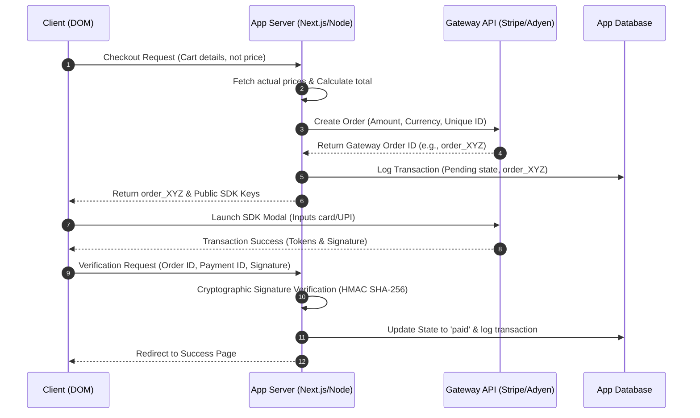

# Global Payment Gateway Integration Architecture & Best Practices

This document provides a comprehensive, platform-agnostic technical analysis of how modern online payment gateways are integrated into web applications, comparing frontend integration flows, backend security lifecycles, and multi-gateway orchestration strategies.

📋 Key Findings from the Research
Frontend Integration Models:

Redirect (Hosted Pages): Safest, easiest to build, and simplifies PCI compliance (SAQ A), but introduces user redirect friction.
Embedded iFrame (Hosted Fields): Displays inputs directly inside your layout, served securely from the payment provider (SAQ A-EP).
SDK Elements (e.g., Stripe/Razorpay Elements): Optimized modern components that automatically support local wallets (Apple Pay, Google Pay) while handling client-side tokenization.
The 5-Step Backend Security Lifecycle:

Server-Side Pricing: The backend must calculate cart totals based on databases, not client inputs.
Cryptographic Verification: Signatures are checked using HMAC-SHA256 calculations: $$\text{HMAC-SHA256}(\text{order_id} + \text{"|"} + \text{payment_id}, \text{secret_key})$$
Idempotency: UUID keys protect transactions from duplicate charges during retry attempts.
Webhooks: Essential for catching payment completions if clients close their tab before redirects resolve.
Enterprise Orchestration:

Implementing a Payment Orchestration Layer using the Strategy Pattern abstracts client applications from gateway-specific code. This enables active-active routing, regional fee optimization, and automatic failovers if a primary gateway goes offline.
Provider Landscape:

Stripe: Premier DX and subscription engines (startups/SaaS).
Adyen: High-volume, enterprise cross-border acquirer setups.
PayPal: Wallet authority and consumer trust.
Razorpay: South-Asian market leader (specifically UPI and localized netbanking).

---

## 1. Frontend Integration Models

How a customer interacts with the payment interface dictates the security profile, development effort, and conversion rate of the checkout flow. There are three standard industry patterns:

| Integration Model                   | Description                                                                                                           | PCI Compliance                                                           | Conversion/UX Impact                                                                 | Development Effort                                                |
| :---------------------------------- | :-------------------------------------------------------------------------------------------------------------------- | :----------------------------------------------------------------------- | :----------------------------------------------------------------------------------- | :---------------------------------------------------------------- |
| **Redirect (Hosted Payment Page)**  | The user is redirected to a page hosted entirely by the gateway (e.g., Stripe Checkout, PayPal checkout flow).        | **Lowest** (SAQ A)<br>No card data touches your DOM or server.           | **High Friction**<br>Redirecting to another URL can feel jarring and decrease trust. | **Very Low**<br>Requires minimal frontend integration.            |
| **Embedded iFrame (Hosted Fields)** | The payment fields are iFrames served directly from the gateway but visually styled and embedded inside your layout.  | **Low-Moderate** (SAQ A-EP)<br>Protects against DOM-based card sniffing. | **Seamless**<br>The checkout happens entirely on-site with matching style.           | **Medium**<br>Requires managing iframe sizing and responsiveness. |
| **Modern Elements SDKs**            | A component-based SDK (e.g., Stripe Elements, Adyen Web Components) that renders optimized UI inputs inside your app. | **Low-Moderate** (SAQ A-EP)<br>Handled using tokenization scripts.       | **Optimal**<br>Supports autofill, Apple Pay/Google Pay, and local methods natively.  | **Medium-High**<br>Requires client-side JS SDK state management.  |

---

## 2. The 5-Step Backend Security Lifecycle

To prevent charge tampering, carding attacks, or order spoofing, the application backend must handle the payment lifecycle using a rigid verification process.



### Key Security Implementations:

1.  **Server-Side Price Locking**: The client should _never_ send the checkout amount. The client sends a reference (e.g. `order_id` or `cart_items`), and the backend fetches current prices from the database, computes the final total, and requests the payment from the gateway.
2.  **Cryptographic Verification**: When a transaction succeeds, the gateway returns a payload consisting of the `order_id`, `payment_id`, and a `signature`. The server must calculate the cryptographic hash using its private **Secret Key** and compare it with the signature:
    $$\text{HMAC-SHA256}(\text{order\_id} + \text{"|"} + \text{payment\_id}, \text{secret\_key}) == \text{signature}$$
3.  **Idempotency**: All payment API request calls (especially retries on timeouts) must include an `Idempotency-Key` (typically a UUID). This prevents duplicate charges if the network connection breaks mid-request.
4.  **Asynchronous Webhooks**: Webhooks are automated HTTP POST calls sent by the gateway directly to your server to notify you of event status changes. They are critical because users might close the checkout window before the frontend redirect succeeds.
5.  **PCI-DSS Scope Reduction**: Avoid receiving raw credit card numbers on your server. Utilize tokenization methods (such as Stripe Tokens, Adyen Card Components) so the browser sends cards directly to the provider, returning a secure payment token.

---

## 3. Multi-Gateway Orchestration (Enterprise Pattern)

Scaling businesses often decouple from a single provider by introducing a **Payment Orchestration Layer** to handle failover, dynamic routing, and localization.

```
                  +--------------------------------+
                  |    Client Checkout Interface   |
                  +--------------------------------+
                                  |
                                  v
                  +--------------------------------+
                  |   Payment Orchestration API   |
                  +--------------------------------+
                                  |
            +---------------------+---------------------+
            |                     |                     |
            v                     v                     v
  +-------------------+ +-------------------+ +-------------------+
  |    Stripe (US)    | |    Adyen (EU)     | |   Razorpay (IN)   |
  +-------------------+ +-------------------+ +-------------------+
```

### Components of Orchestration:

- **The Abstraction Layer**: Implementing the _Strategy Pattern_ by defining a generic `PaymentProvider` interface in code:
  ```typescript
  interface PaymentProvider {
    createOrder(amount: number, currency: string): Promise<OrderResult>;
    verifyPayment(params: VerifyParams): Promise<boolean>;
    refund(paymentId: string, amount: number): Promise<RefundResult>;
  }
  ```
  This decoupling ensures that if you swap gateways, your main application logic remains untouched.
- **Dynamic Routing**: Routing requests dynamically based on:
  - **Geographical Location**: Directing European users to Adyen (lower rates for SEPA/MisterCash) and Indian users to Razorpay (optimized for local UPI intents).
  - **Health and Latency**: If Stripe API latency spikes above a threshold, the orchestrator redirects new checkout requests to Adyen.
- **Passive-Active Failover**: If the primary gateway returns a `502 Bad Gateway` or a temporary payment processor rejection, the orchestrator falls back to retry on the secondary provider instantly without disrupting the customer.

---

## 4. Comparison of Industry Providers

| Provider     | Core Strength                                                                                           | Target Audience                                            | Key Limitations                                                                          |
| :----------- | :------------------------------------------------------------------------------------------------------ | :--------------------------------------------------------- | :--------------------------------------------------------------------------------------- |
| **Stripe**   | Best developer experience (DX), documentation, and SDK tooling. Seamless subscription engine.           | Startups, SaaS, and global digital businesses.             | Higher basic processing fees in standard regions compared to local acquiring.            |
| **Adyen**    | Multi-acquirer network with deep local card networks. Optimized for enterprise volume.                  | Large scale retailers, international e-commerce platforms. | Extremely high entry threshold; complex contracting.                                     |
| **PayPal**   | Brand trust. Massive customer base who prefer digital wallets over inputting card details.              | Consumer e-commerce.                                       | High dispute ratios, higher transactional fees, and historically clunky API integration. |
| **Razorpay** | Tailored specifically for the Indian market. Native UPI, netbanking integrations, and COD verification. | Businesses operating primarily in India.                   | Restricted geographic coverage outside of India / South-East Asia.                       |
